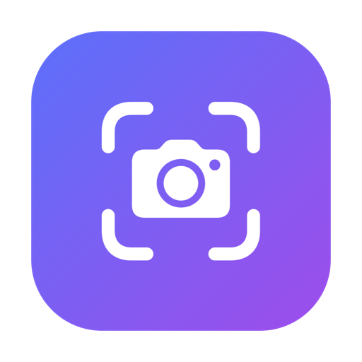
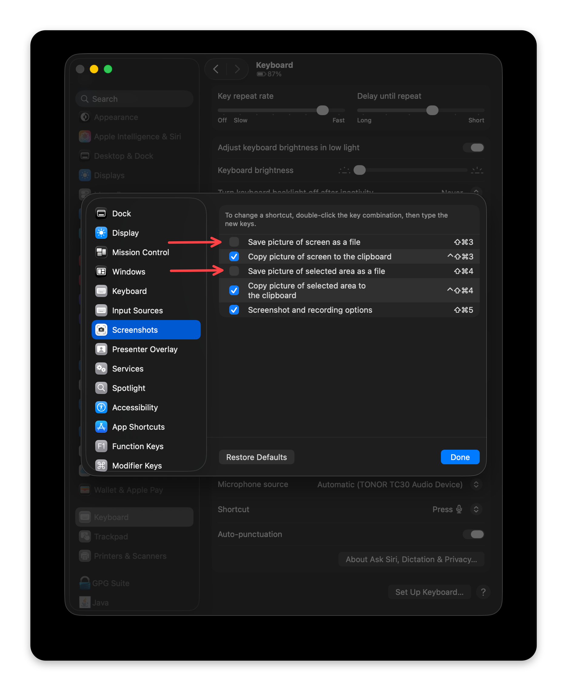

<p align="center">
  
</p>
<h1 align="center">Shotty</h1>
<p align="center">A tiny macOS menu-bar screenshot annotator &amp; beautifier.</p>
<p align="center">
  
</p>

Capture a region, window, or the whole screen, then mark it up — arrows, boxes, blur/pixelate,
text — on a gradient / solid / transparent background with padding, rounded corners and a shadow.
Native Swift, no dependencies.

## Install

1. Download the latest **`Shotty-x.y.zip`** from the [Releases page](https://github.com/lordkerwin/shotty/releases/latest).
2. Unzip it and drag **Shotty.app** to your **Applications** folder.
3. First launch: right-click **Shotty.app ▸ Open** (it's self-signed, not notarized, so a plain
   double-click is blocked by Gatekeeper). If macOS still refuses, run once:
   ```bash
   xattr -dr com.apple.quarantine /Applications/Shotty.app
   ```
4. Shotty runs in the **menu bar** (◉ camera icon) — no Dock icon. To keep it running after reboot,
   add it under **System Settings ▸ General ▸ Login Items**.

The first capture asks for **Screen Recording** permission — grant it in System Settings and relaunch.

## Hotkeys

- **⌘⇧3** — capture the whole screen
- **⌘⇧4** — capture a region (press **Space** mid-drag to grab a window instead)

These reuse macOS's own screenshot keys, so hand them to Shotty first (reversible):

```bash
./Scripts/macos-screenshots.sh disable    # 'enable' to restore macOS's defaults
```

Or do it manually in **System Settings ▸ Keyboard ▸ Keyboard Shortcuts ▸ Screenshots** — untick
*"Save picture of screen as a file"* (⇧⌘3) and *"Save picture of selected area as a file"* (⇧⌘4):

<p align="center">
  
</p>

You can also trigger a capture from the menu-bar icon.

## Editing

- **Tools:** Select, Arrow, Rect, Blur, Pixelate, Text. Newly drawn items are auto-selected.
- **Reshape:** with Select, drag the handles; the round handle rotates (snaps to 45°). The top slider
  sets thickness / font size for the selection; blur & pixelate get an intensity slider.
- **Colour:** the swatch row recolours the selected item live.
- **Background:** No Background (transparent PNG), a gradient, or a plain colour, plus Padding,
  Corners, Shadow and aspect Ratio.
- **⌘C / ⌘V** duplicate · **⌘Z / ⌘⇧Z** undo/redo · **Duplicate** button clones the selection.
- **Copy** puts the composite on the clipboard; **Save…** writes a PNG (transparent when No
  Background is selected).

## Updates

Shotty checks GitHub Releases on launch (and via **Check for Updates…** in the menu). If a newer
release exists it shows a dialog linking to the release page — you download and swap it in yourself;
the app never downloads anything. Dismissing the dialog won't nag you again until an even newer
version ships.

## Build from source

```bash
swift run shotty     # dev run (permission attaches to your terminal)
./build-app.sh       # build Shotty.app into the project folder
```

`build-app.sh` signs with a stable self-signed identity so the Screen Recording grant survives
rebuilds — create it once with `./Scripts/dev-cert.sh` (otherwise it ad-hoc signs and macOS
re-prompts every build). Cutting a release (`Scripts/release.sh`) builds, zips, and publishes a
GitHub Release with the app attached.
